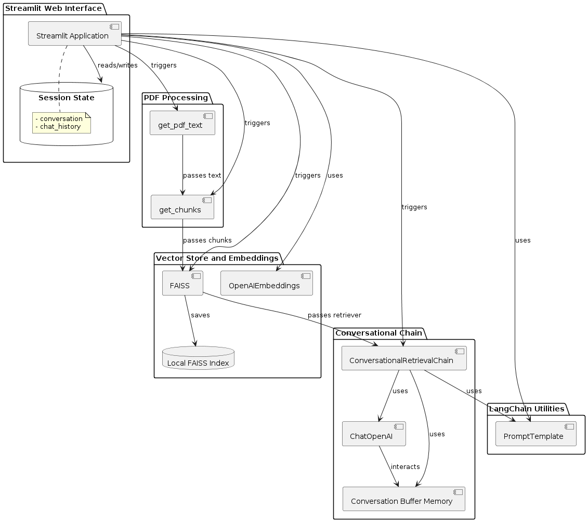
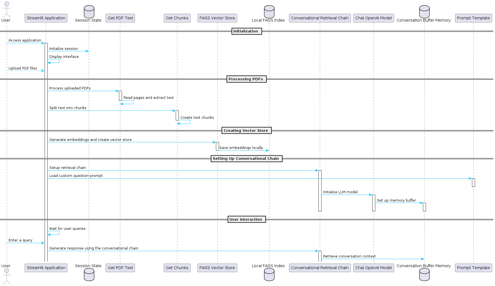

# Building a Conversational PDF Assistant with Streamlit and OpenAI

## Introduction

This tutorial guides you through the process of building a conversational assistant that can interact with users via a web interface and provide responses based on the contents of a PDF document. We will be using Streamlit for the web interface, PyPDF2 for handling PDF documents, Langchain for language AI operations, and OpenAI's powerful models to generate answers.

## Prerequisites

Before starting, make sure you have:
- Python installed on your computer.
- Basic knowledge of Python programming.
- Streamlit, PyPDF2, Langchain, and OpenAI libraries installed in your Python environment.

## Step 1: Import Required Libraries

First, import all necessary libraries and initialize any required environment variables.

```python
import streamlit as st
from PyPDF2 import PdfReader
from langchain.text_splitter import RecursiveCharacterTextSplitter
import os
from langchain.vectorstores import FAISS
from langchain.chains.question_answering import load_qa_chain
from langchain.prompts import PromptTemplate
from dotenv import load_dotenv
from langchain_openai import ChatOpenAI, OpenAIEmbeddings

load_dotenv()
openai_api_key = os.getenv("OPENAI_API_KEY")
```

# Step 2: Extracting Text from PDF


# Architecture



# Message Sequence Diagram:
