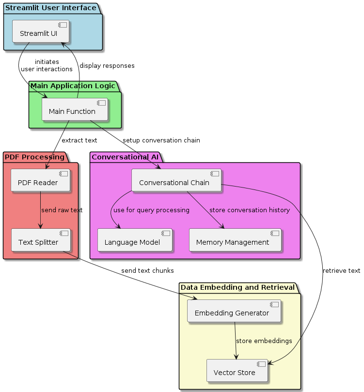
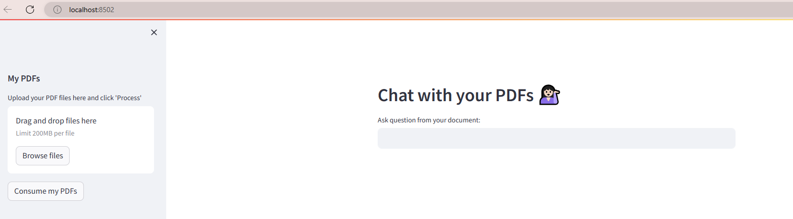
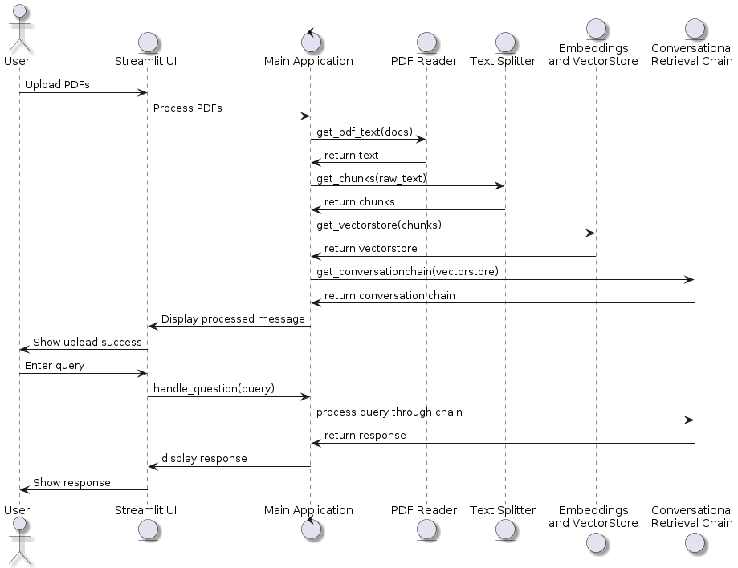

**Background Story:**

Imagine you're a student or a professional researcher tasked with sifting through numerous lengthy documents, perhaps research papers, reports, or academic articles. You're under pressure to find specific information buried within these documents, and it's a time-consuming and daunting task. As you stare at your screen, frustrated by the sheer volume of text to parse through, you wish there was a quicker and more efficient way to extract the relevant information.

This scenario is all too familiar to many individuals who deal with vast amounts of textual data on a daily basis. 


At this point - one might be tempted to shout, **"Use ChatGPT!"** . 

But here's the catch: ChatGPT may know a lot, but it knows nothing about your proprietary documents. Does it? 

Imagine asking ChatGPT to extract insights from your top-secret research report, only to receive a response along the lines of, "I'm sorry, **Jonny Rose**, I'm afraid I can't do that. I don't have access to your classified documents." 

## The Solution

That's where **RAG (Retrieval-Augmented Generation)** comes in. With RAG, we empower language models to understand the context of our documents, providing tailored responses. Say goodbye to generic chatbots and hello to RAG—it's time to revolutionize how we interact with our data!

In our quest for a solution, we turned to LangChain, a versatile tool for natural language processing. Teaming up with RAG, we created a powerful duo capable of conquering document retrieval challenges.

Introducing **Docu-Bot**, our creation fueled by LangChain, RAG, OpenAI's embedding models, and a touch of genius. Docu-Bot seamlessly interacts with your documents, extracting insights with ease—perfect for our friend **Jonny Rose**.


# Let the seriousness begin!

We spared no expense, selecting the best technologies—from OpenAI's embedding models to LangChain's vector stores—to craft a solution fit for Jonny and beyond. And with Streamlit's user-friendly interface, Docu-Bot went from a concept to reality, making document retrieval a breeze, even for Jonny...

### Modules Overview

1. **Text Extraction Module**
   - Responsible for extracting text content from PDF documents uploaded by the user.
   - Includes functions for reading PDF files and extracting text from their pages.

2. **Text Processing Module**
   - Handles the processing of extracted text, including chunking it into manageable segments for further analysis.
   - Utilizes a text splitter to divide the text into chunks based on specified parameters.

3. **Vectorization Module**
   - Generates vector representations of text chunks using OpenAI embeddings.
   - Utilizes FAISS (Facebook AI Similarity Search) to create a vector store for efficient similarity search.

4. **Conversation Model Module**
   - Constructs a conversational retrieval chain for responding to user queries based on the vectorized text chunks.
   - Utilizes a ChatOpenAI model for generating responses and a memory component to retain past conversation information.

5. **User Interface Module**
   - Implements a web-based user interface using Streamlit for users to interact with the chatbot.
   - Includes components for uploading PDF documents, asking questions, and displaying responses.

6. **Custom Template Module**
   - Defines a custom template to guide the language model in understanding and processing conversations and questions.
   - Provides a structured format for presenting chat history and follow-up questions.

7. **Main Module**
   - Serves as the entry point of the application.
   - Sets up the Streamlit web interface, orchestrates the workflow of the different modules, and handles user interactions.


## Technologies Used

- **Python**: Primary programming language.
- **Streamlit**: For creating the web interface.
- **dotenv**: For loading environment variables.
- **PyPDF2**: For reading PDF files and extracting text.
- **LangChain**: To facilitate the creation of conversational AI using components like embeddings, vector stores, and conversational chains.
- **OpenAI**: For accessing pre-trained language models and Embedding Models
- **FAISS**: For efficient similarity search and clustering of dense vectors.
- **CSS and HTML Templates**: For customizing the user interface and displaying chat messages.

## Installation and Setup

1. **Clone the Repository**: Clone this repository to your local machine.
2. **Environment Setup**:
    - Create a virtual environment: `python -m venv venv`
    - Activate the environment: `source venv/bin/activate` (Linux/Mac) or `.\venv\Scripts\activate` (Windows)
    - Install the required packages: `pip install -r requirements.txt`
3. **API Keys**:
    - You will need an API key from OpenAI. Set this key in a `.env` file as `OPENAI_API_KEY=<your_api_key_here>`.
4. **Run the Application**:
    - Start the Streamlit application by running: `streamlit run app.py`

## Usage

- **Starting the App**: Once the application is running, navigate to the provided local URL (usually `http://localhost:8501`).
- **Uploading PDFs**: Use the sidebar to upload one or more PDF documents from which you want to source information.
- **Processing PDFs**: Click on 'Process' after uploading the PDFs to extract text, generate embeddings, and prepare the conversational retrieval system.
- **Asking Questions**: Enter questions in the input field at the main screen. The system uses the context of previously asked and answered questions along with the content from the PDFs to generate relevant answers.
- **Interacting with Responses**: The responses will be displayed under the question input field, styled to differentiate between user questions and system responses.

## High Level Architecture



## Intent of the Program

This program is designed to enhance document interaction by enabling a natural language querying mechanism over the content stored within multiple PDF files. It provides an innovative way to explore document contents without manually searching through each page, making it an excellent tool for researchers, analysts, and anyone who works with large volumes of textual information in PDF format.

### 1. Importing Dependencies

This section imports necessary libraries and modules for the program. Each library serves a specific purpose, such as interacting with the operating system, processing PDF files, creating web interfaces, and implementing natural language processing tasks.

```python
import os
from dotenv import load_dotenv
load_dotenv()
import streamlit as st
from PyPDF2 import PdfReader
from langchain.text_splitter import CharacterTextSplitter
from langchain_openai import OpenAIEmbeddings
from langchain.vectorstores import FAISS
from langchain_community.vectorstores import FAISS
from langchain.prompts import PromptTemplate
from langchain.memory import ConversationBufferMemory
from langchain.chains import ConversationalRetrievalChain
from langchain.chat_models import ChatOpenAI
from html_stylesheet import css, bot_template, user_template
```

### 2. Custom Template

A custom template is defined here to guide the language model in understanding and processing conversations and questions. It provides a structured format for presenting chat history and follow-up questions.

```python
custom_template = """
Given the following conversation and a follow-up question, rephrase the follow-up question to be a standalone question, in its original language.
Chat History:
{chat_history}
Follow-Up Input: {question}
Standalone Question:
"""
```

### 3. Text Extraction from PDFs

The `get_pdf_text()` function extracts text from PDF documents uploaded by the user. It iterates through each uploaded PDF file, reads its pages, and extracts text content.

```python
def get_pdf_text(docs):
    text=""
    for pdf in docs:
        pdf_reader=PdfReader(pdf)
        for page in pdf_reader.pages:
            text+=page.extract_text()
    return text
```

### 4. Text Chunking

`get_chunks()` function splits the extracted text into manageable chunks for processing. It uses langchain's `CharacterTextSplitter` to split the text based on specified parameters like chunk size and overlap.

```python
def get_chunks(raw_text):
    text_splitter=CharacterTextSplitter(separator="\n",
                                        chunk_size=1000,
                                        chunk_overlap=200,
                                        length_function=len)   
    chunks=text_splitter.split_text(raw_text)
    return chunks
```

### 5. Generating Vector Store

`get_vectorstore()` function utilizes OpenAI embeddings and FAISS to create a vector store for the text chunks. This vector store will be used for similarity search during the conversation.

```python
def get_vectorstore(chunks):
    embeddings = OpenAIEmbeddings()
    vector_store = FAISS.from_texts(chunks, embedding=embeddings)
    vector_store.save_local("faiss_index")
    return vector_store
```

### 6. Generating Conversation Chain

The `get_conversationchain()` function constructs a conversational retrieval chain using the created vector store and a ChatOpenAI model. It sets up memory to hold past conversation information.

```python
def get_conversationchain(vectorstore):
    llm=ChatOpenAI(temperature=0.2)
    memory = ConversationBufferMemory(memory_key='chat_history', 
                                      return_messages=True,
                                      output_key='answer')
    conversation_chain = ConversationalRetrievalChain.from_llm(
                                llm=llm,
                                retriever=vectorstore.as_retriever(search_type="similarity", search_kwargs={"k": 6}),
                                condense_question_prompt=CUSTOM_QUESTION_PROMPT,
                                memory=memory)
    
    return conversation_chain
```

### 7. Handling User Queries

The `handle_question()` function processes user queries, retrieves relevant responses using the conversation chain, and displays them in the web interface.

```python
def handle_question(question):
    response=st.session_state.conversation({'question': question})
    st.session_state.chat_history=response["chat_history"]
    for i,msg in enumerate(st.session_state.chat_history):
        if i%2==0:
            st.write(user_template.replace("{{MSG}}",msg.content,),unsafe_allow_html=True)
        else:
            st.write(bot_template.replace("{{MSG}}",msg.content),unsafe_allow_html=True)
```

### 8. Main Function

The `main()` function sets up the Streamlit web interface. It allows users to upload PDF documents, ask questions, and interact with the chatbot.

```python
def main():
    load_dotenv()
    st.set_page_config(page_title="Chat with multiple PDFs",page_icon=":books:")
    st.write(css,unsafe_allow_html=True)
    if "conversation" not in st.session_state:
        st.session_state.conversation=None

    if "chat_history" not in st.session_state:
        st.session_state.chat_history=None
    
    st.header("Chat with multiple PDFs :books:")
    question=st.text_input("Ask question from your document:")
    if question:
        handle_question(question)
    with st.sidebar:
        st.subheader("Your documents")
        docs=st.file_uploader("Upload your PDF here and click on 'Process'",accept_multiple_files=True)
        if st.button("Process"):
            with st.spinner("Processing"):
                
                #get the pdf
                raw_text=get_pdf_text(docs)
                
                #get the text chunks
                text_chunks=get_chunks(raw_text)
                
                #create vectorstore
                vectorstore=get_vectorstore(text_chunks)
                
                #create conversation chain
                st.session_state.conversation=get_conversationchain(vectorstore)


if __name__ == '__main__':
    main()
```

# The outcome

**Run the Streamlit App**: Once you're in the project directory, simply run the following command:

    ```
    streamlit run your_app.py
    ```

    Replace `your_app.py` with the name of your Streamlit app file.
1. **Access the App**: After running the command, Streamlit will start a local development server, and you'll see a message indicating the URL where your app is hosted (usually `http://localhost:8501`). Open your web browser and navigate to this URL to access your Streamlit app.

#### You should see something like this:



2. **Interact with the App**: Once the app is loaded in your browser, you can upload PDF documents, ask questions, and explore the functionalities provided by the app.

3. **Stop the Streamlit Server**: To stop the Streamlit server, you can simply press `Ctrl + C` in your terminal or command prompt. This will gracefully shut down the server, and you'll no longer be able to access the app until you run the command again.

# The detailed Flow 

For the people interested in details code flow - here is a message sequence diagram that you could follow:




That's it! You've successfully run your Streamlit app and can now explore its features and functionalities.


I’m Rohit, an R&D Manager - insanely passionate about AI/ML Innovations.
Please feel free to connect if you’re intrigued by the vastness and possibilities in LangChain Templates or have insights to share.
Let's learn together and push the boundaries of what’s possible in AI development.


Enjoy Folks.