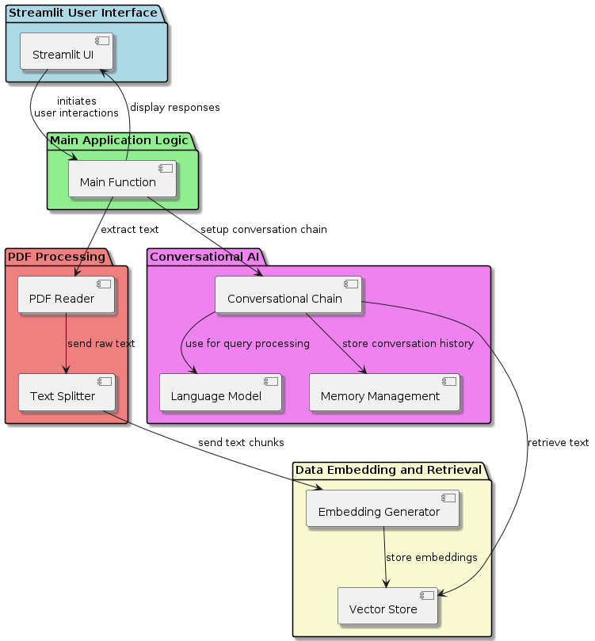
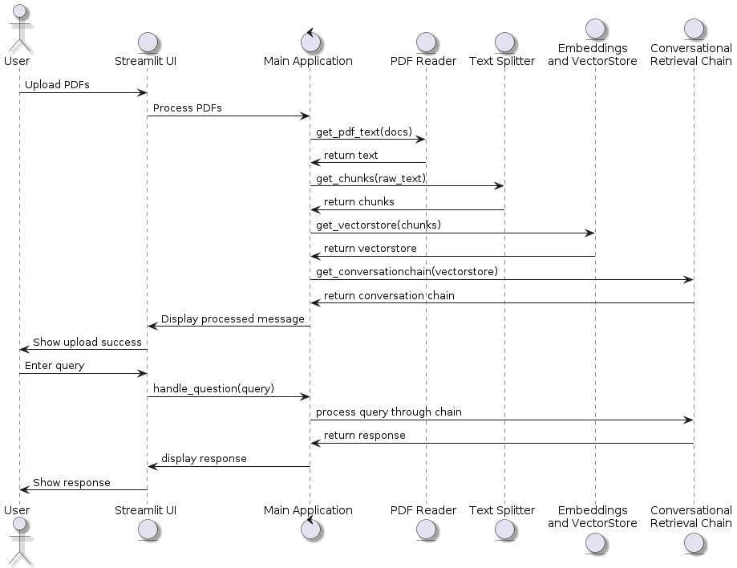

# Chat with Multiple PDFs

## Project Overview

This project creates an interactive chat application using Streamlit that allows users to upload PDF documents and ask questions based on the content of those documents. It leverages the power of large language models and vector-based retrieval systems to provide contextual responses, effectively creating a conversational search system across the text of multiple PDF files.

## Core Features

1. **PDF Text Extraction**: Extracts text from uploaded PDF documents using the PyPDF2 library.
2. **Text Chunking**: Splits the extracted text into manageable chunks that help in efficient processing and retrieval.
3. **Semantic Embeddings and Vector Storage**: Uses `sentence-transformers` for generating embeddings and FAISS for storing and indexing these embeddings to facilitate efficient text retrieval.
4. **Conversational Context Handling**: Utilizes a conversational retrieval chain which combines a language model from Hugging Face, a custom retrieval system, and a conversation buffer memory to maintain context and provide accurate responses.
5. **Custom Question Rephrasing**: Features a custom prompt template to guide the model in generating standalone questions from follow-up user inputs, preserving context and original language nuances.

# Architecture

## Technologies Used

- **Python**: Primary programming language.
- **Streamlit**: For creating the web interface.
- **dotenv**: For loading environment variables.
- **PyPDF2**: For reading PDF files and extracting text.
- **LangChain**: To facilitate the creation of conversational AI using components like embeddings, vector stores, and conversational chains.
- **Hugging Face**: For accessing pre-trained language models.
- **FAISS**: For efficient similarity search and clustering of dense vectors.
- **CSS and HTML Templates**: For customizing the user interface and displaying chat messages.

## Installation and Setup

1. **Clone the Repository**: Clone this repository to your local machine.
2. **Environment Setup**:
    - Create a virtual environment: `python -m venv venv`
    - Activate the environment: `source venv/bin/activate` (Linux/Mac) or `.\venv\Scripts\activate` (Windows)
    - Install the required packages: `pip install -r requirements.txt`
3. **API Keys**:
    - You will need an API key from Hugging Face. Set this key in a `.env` file as `HUGGINGFACE_API_KEY=<your_api_key_here>`.
4. **Run the Application**:
    - Start the Streamlit application by running: `streamlit run app.py`

## Usage

- **Starting the App**: Once the application is running, navigate to the provided local URL (usually `http://localhost:8501`).
- **Uploading PDFs**: Use the sidebar to upload one or more PDF documents from which you want to source information.
- **Processing PDFs**: Click on 'Process' after uploading the PDFs to extract text, generate embeddings, and prepare the conversational retrieval system.
- **Asking Questions**: Enter questions in the input field at the main screen. The system uses the context of previously asked and answered questions along with the content from the PDFs to generate relevant answers.
- **Interacting with Responses**: The responses will be displayed under the question input field, styled to differentiate between user questions and system responses.

## Intent of the Program

This program is designed to enhance document interaction by enabling a natural language querying mechanism over the content stored within multiple PDF files. It provides an innovative way to explore document contents without manually searching through each page, making it an excellent tool for researchers, analysts, and anyone who works with large volumes of textual information in PDF format.

# Logic Sequence Diagram:

